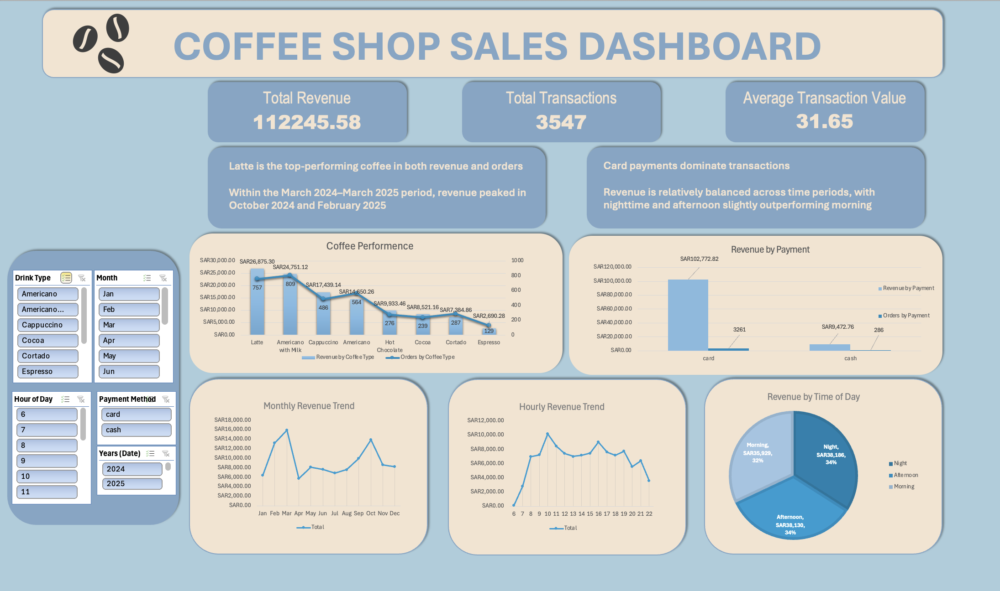

# Coffee Shop Sales Dashboard (Excel)

An interactive dashboard built using Microsoft Excel to analyze coffee shop sales performance and uncover key business insights.

---

## 📊 Overview
This project analyzes transactional sales data to identify trends in revenue, customer behavior, product performance, and payment preferences.

---

## 🛠 Tools Used
- Microsoft Excel  
- Pivot Tables  
- Pivot Charts  
- Slicers  

---

## 📈 Key Insights
- Latte is the top-performing product in both revenue and number of orders  
- Revenue peaked in October 2024 and February 2025 within the analyzed period  
- Card payments dominate transactions, indicating strong customer preference for digital payments  
- Revenue is relatively balanced across time periods, with nighttime and afternoon slightly higher  
- 10 AM is the peak single hour, while revenue is distributed across evening hours  

---

## 📂 Files
- `coffee-dashboard.xlsx` → Excel dashboard  
- `coffee-report.pdf` → Project report  
- `dashboard-preview.png` → Dashboard image  

---

## 📸 Dashboard Preview

