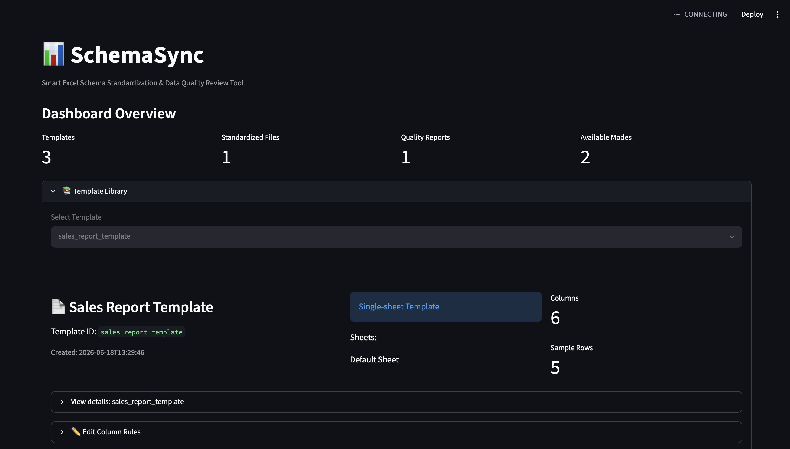
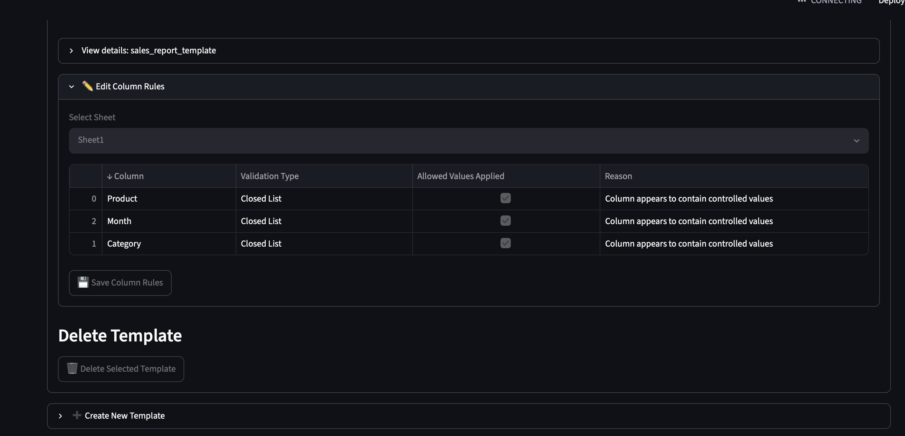
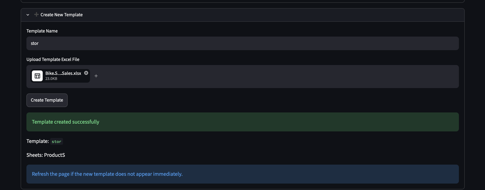
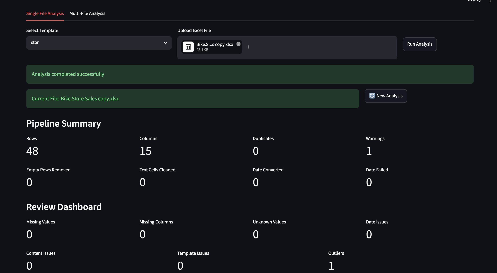
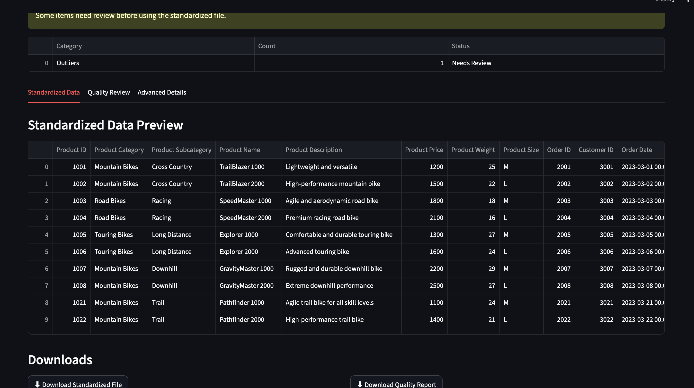
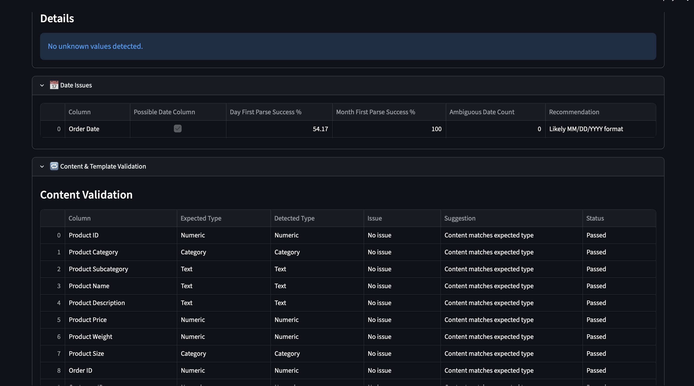

## 📸 Screenshots

### 🏠 Dashboard Overview

Provides a high-level summary of available templates, generated reports, and supported processing modes.

---

### 📚 Template Management

Manage templates, review metadata, configure validation rules, and control template settings.

---

### ➕ Create New Template

Create reusable validation templates directly from Excel files.

---

### 📊 Single File Analysis

Upload an Excel file, select a template, and run automated validation and standardization.

---

### ✅ Standardized Data & Results

Review the standardized dataset and generated outputs after processing.

---

### 🔍 Data Quality Review

Detailed validation reports including schema checks, content validation, date analysis, unknown values detection, and outlier reporting.

